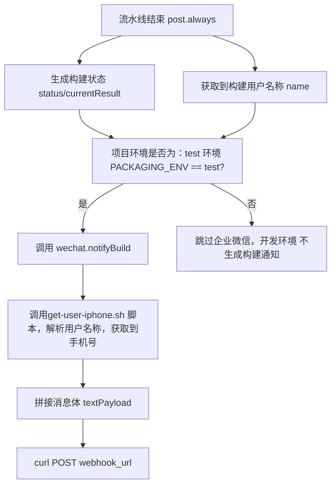

# Jenkins 企微群构建通知（@构建者）实现方法

## 一、概述

## 1.1 流程概述：



## 1.2 环境前提概述：

* 需要维护一份人员名单，企微@群员 可通过手机号的方式，来@群员，所以手机号是唯一。

  

* 人员名单脚本：【存放在 jenkins 服务器上，方便流水线直接调用】

```
#get-user-iphone.sh

#!/usr/bin/env bash
set -euo pipefail

name="${1:-}"

case "$name" in
  "admin") echo "13000000000" ;;
  "张三") echo "13000000001" ;;
  "李四") echo "13000000002" ;;
  "王五") echo "13000000003" ;;
  *)
    echo ""
    ;;
esac
```

这里人员名单的用户名我们要维护好在 jenkins 上，这个用户名是 jenkins 上的全局唯一。

【关于如何批量创建用户，导入用户，可以参考：https://opforge.srebro.cn/devops/jenkins/09/09-1.html】

jenkins 流水线在构建结束之后 ，可以获取到 构建动作是哪个用户触发的。就执行这个脚本 来获取到对应用户的手机号，再执行 webhook 的发送构建通知动作。

# 二、实现步骤

> 本案例采用 jenkins 共享库的方式来实现


## 2.1 入口配置

Jenkinsfile 中通过 `webhook_url` 传入企业微信机器人 Webhook，并调用共享库入口：

```groovy
def map = [:]
map.put('packaging_env','test')
map.put('webhook_url','https://qyapi.weixin.qq.com/cgi-bin/webhook/send?key=81abf299-9946-426a-827a-cef9a00de4ea')
map.put('git_credentials_id','xxxxxxxxxxxx')
map.put('default_branch','test')
map.put('project_choices', projectChoices)
map.put('project_config', projectConfig)

deploy_front(map)
```


## 2.2 通知触发位置

流水线在 `post.always` 里统一发送邮件与企业微信通知（仅 test 环境发送企业微信通知）：

```groovy
post {
  always {
    wrap([$class: 'BuildUser']) {
      script {
        if (!(params.SKIP_PIPELINE || (currentBuild.rawBuild?.getCause(hudson.triggers.TimerTrigger$TimerTriggerCause) != null))) {
          if (env.PROJECT_WORKSPACE) {
            ws(env.PROJECT_WORKSPACE) {
              cleanWs()
            }
          }
          def status = "${currentBuild.currentResult}"
          email.Email(status)
          if (env.PACKAGING_ENV == 'test') {
            wechat.notifyBuild(env.WEBHOOK_URL, [
              status: status,
              buildTime: env.BUILD_TIME,
              projectName: params.PROJECT_NAME,
              gitBranch: params.GIT_BRANCH
            ])
          }
        }
      }
    }
  }
}
```


## 2.3 手机号解析与 @人逻辑

通知对象基于 Jenkins 的构建者用户名 `env.BUILD_USER`：

1. 优先调用 Jenkins 服务器上的脚本 `/opt/application/get-user-iphone.sh` 获取手机号  
2. 如果脚本未返回手机号，则尝试读取 `USER_MOBILE_MAP_JSON` 环境变量  
3. 再否则尝试读取工作区内的 `user_mobile_map.json` 文件  
4. 得到手机号后，加入 `mentioned_mobile_list`，同时 `mentioned_list` 里包含用户名  

脚本示例（Jenkins 服务器上）：

```bash
#get-user-iphone.sh

#!/usr/bin/env bash
set -euo pipefail

name="${1:-}"

case "$name" in
  "admin") echo "13000000000" ;;
  "张三") echo "13000000001" ;;
  "李四") echo "13000000002" ;;
  "王五") echo "13000000003" ;;
  *)
    echo ""
    ;;
esac
```

## 2.4 企业微信发送实现

核心发送逻辑在共享库 `org.devops.wechat`：

```groovy
def notifyBuild(webhookUrl, args = [:]) {
  def buildStatus = args.status ?: (currentBuild?.currentResult ?: 'UNKNOWN')
  def statusIcon = buildStatus == 'SUCCESS' ? '✅' : '❌'
  def buildUser = env.BUILD_USER ?: '系统自动'
  def projectName = (args.projectName ?: env.PROJECT_NAME)
  def gitBranch = args.gitBranch ?: (env.GIT_BRANCH ?: '')

  def resolveMobileForUser = { username ->
    def mobile = null
    try {
      try {
        def out = sh(script: """if [ -x /opt/application/get-user-iphone.sh ]; then /opt/application/get-user-iphone.sh '${username}' || true; fi""", returnStdout: true).trim()
        if (out) {
          mobile = out
        }
      } catch (e1) {
        echo "获取手机号失败: ${e1}"
      }
      if (!mobile && env.USER_MOBILE_MAP_JSON && env.USER_MOBILE_MAP_JSON.trim()) {
        def map = new groovy.json.JsonSlurper().parseText(env.USER_MOBILE_MAP_JSON)
        mobile = map[username]
      } else if (!mobile && fileExists('user_mobile_map.json')) {
        def json = readFile(file: 'user_mobile_map.json')
        def map = new groovy.json.JsonSlurper().parseText(json)
        mobile = map[username]
      }
    } catch (e) {
      echo "解析手机号映射失败: ${e}"
    }
    return mobile
  }

  def userMobile = resolveMobileForUser(buildUser)
  def notifyNames = new LinkedHashSet<String>()
  notifyNames << buildUser
  def notifyMobiles = new LinkedHashSet<String>()
  if (userMobile) {
    notifyMobiles << userMobile
  }

  def textPayload = [
    msgtype: "text",
    text   : [ content: "${statusIcon} 构建状态: ${buildStatus}\n项目名称: ${projectName}\n构建分支: ${(gitBranch ?: 'master')}" ]
  ]
  if (!notifyMobiles.isEmpty()) {
    textPayload.text.mentioned_mobile_list = notifyMobiles.toList()
  }
  textPayload.text.mentioned_list = notifyNames.toList()
  writeFile file: 'text_message.json', text: groovy.json.JsonOutput.toJson(textPayload)

  sh """
    curl -s -H "Content-Type: application/json" -X POST -d @text_message.json "${webhookUrl}"
    rm -f text_message.json
  """
}
```

# 三、最终效果


